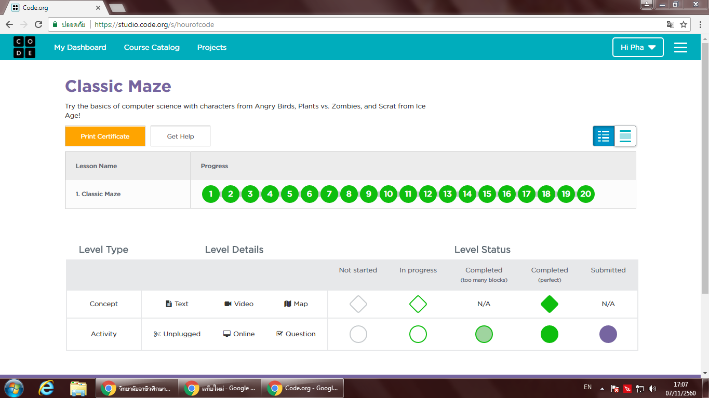

# tp_prog_week3
งานครั้งที่ 4 วิชาการเขียนโปรแกรมคอมพิวเตอร์ ปวส1

## วิธีการส่งงาน

1.  บันทึกหน้า dashboard ของแต่ละกิจกรรม
2.  **ตั้งชื่อตามนี้**
    -  Angry Bird เป็น lab1.png
    -  Frozen เป็น lab2.png
    -  Star wars เป็น lab3.png
    -  Minecraft เป็น lab4.png
3.  อัพทั้ง 4 รูปไว้ใน folder img (เมื่อสำเร็จไฟล์จะมีภาพปรากฎ)
4.  เขียนสรุปสิ่งที่ได้ด้วย

------------------------------------------

## กิจกรรมทดลอง Angry bird

### ภาพยืนยันความสมบูรณ์ (3 points)

### สรุปสิ่งที่ได้เรียนรู้จากกิจกรรม (2 points)

$$$$1

ได้รู้การใช้คำสั่งเดินไปข้างหน้า เลี้ยวซ้าย เลี้ยวขวา
รู้การใช้คำสั่ง repeat ในการทำซ้ำ

1$$$$

-------------------------------------------

## กิจกรรมทดลอง Frozen

### ภาพยืนยันความสมบูรณ์ (3 points)

### สรุปสิ่งที่ได้เรียนรู้จากกิจกรรม (2 points)

$$$$2

- รู้การใช้ repeat เพื่อทำซ้ำ
- รู้โค้ดการเลี้ยวแบบองศา
- ได้สร้างวงกลม
- ได้รู้การเคลื่อนไหวไปข้างหน้าแบบpixel

2$$$$

------------------------------------------

## กิจกรรมทดลอง Star wars

### ภาพยืนยันความสมบูรณ์ (3 points)

### สรุปสิ่งที่ได้เรียนรู้จากกิจกรรม (2 points)

$$$$3

ได้รู้การเคลื่อนไหวของเกม การเคลื่อนไหวไปข้างบน เคลื่อนไหวลงข้างล่าง เคลื่นไหวไปทางซ้าย เคลื่อนไหวไปทางขวา
ได้รู้ที่มาของคะแนนที่เราได้เวลาเล่นเกม

3$$$$

-------------------------------------------

## กิจกรรมทดลอง Minecraft

### ภาพยืนยันความสมบูรณ์ (3 points)

### สรุปสิ่งที่ได้เรียนรู้จากกิจกรรม (2 points)

$$$$4

ได้รู้การใช้ forever do การใช้ when spawned 
ได้รู้ที่มาของคะแนนในเกม ว่าเราได้คะแนนมายังไง

4$$$$

-------------------------------------------

## สรุปคะแนน

| Topic          | Score           |
| :------------- | :-------------: |
| Angry Bird 1   |                 |
| Angry Bird 2   |                 |
| Frozen 1       |                 |
| Frozen 2       |                 |
| Star wars 1    |                 |
| Star wars 2    |                 |
| Minecraft 1    |                 |
| Minecraft 2    |                 |

**รวม :** 0 คะแนน
